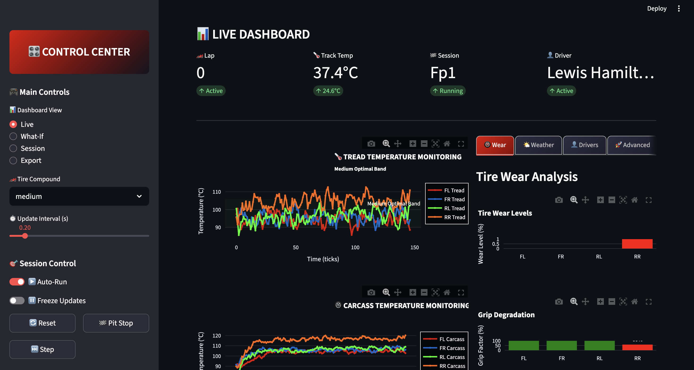

[](https://github.com/ac12644/f1-tire-temp-prototype/actions/workflows/tests.yml)

# F1 Tire Temperature Management Prototype

Prototype for simulating and managing **F1-style tire temperatures** using Python, Streamlit, and Extended Kalman Filtering.  
Includes live telemetry simulation, pit stop logic, compound switching, decision engine, and modelpacks for different tracks.

---

## Screenshot



---

## Why Tires Matter

- The **only thing** connecting the car to the track = 4 small rubber
  patches.
- Tires must stay in their **optimal temperature window** for max
  grip.
  - Too cold → stiff, low grip.
  - Too hot → greasy, fast wear.

---

## Physics Basics

We model the tire as **three thermal nodes**:

1.  **Tread (Tt)** -- outer rubber, heats fast from sliding/braking,
    cools quickly in airflow.
2.  **Carcass (Tc)** -- tire structure, warms slower, key for grip and
    stiffness.
3.  **Rim (Tr)** -- metal wheel, heated by brakes, conducts heat to/from
    tire.

Heat flows between layers + environment (air, track, wetness).

---

## The Sensor Problem

- Real F1 cars can only measure:
  - **TPMS IR sensors** → tread temp.
  - **Hub sensors** → rim temp.
- But **carcass temp (most important) is hidden!**

---

## Solution: Extended Kalman Filter (EKF)

- Combines the **thermal physics model** with **noisy sensor data**.
- Estimates hidden carcass temp.
- Corrects the simulation when real data disagrees → "smart observer."

---

## Overview

The prototype simulates and monitors tire thermal behavior in a Formula 1 context.  
It provides:

- **Live telemetry simulation** with tread, carcass, and rim temperatures.
- **Kalman-filter-based estimation (EKF)** fusing noisy sensor signals (TPMS & hub).
- **Decision engine** that issues recommendations (e.g., adjust brake bias, driving style).
- **Pit stop and modelpack system** to switch compounds and apply calibration presets.
- **Streamlit UI** for interactive charts, What-If simulation, and data export.

---

## Modules

### `thermal.py`

- Implements a **3-node thermal model** (Tread–Carcass–Rim).
- Uses simplified differential equations driven by slip ratio, slip angle, load, and ambient/track temps.
- Tuned with coefficients (`ThermalParams`).

### `ekf.py`

- Extended Kalman Filter for each tire corner.
- State vector: `[Tt, Tc, Tr]` = Tread, Carcass, Rim.
- Measurements:
  - `m=1`: Tread only (`Tt`).
  - `m=2`: Tread + Rim (`Tt`, `Tr`) → matches TPMS & hub sensors.
  - `m=3`: All states observed.
- Adjusted default measurement covariance **R = 0.3** for faster convergence.

### `simulator.py`

- Generates synthetic telemetry (`TelemetrySim`).
- `step(dt)`: Advances time, produces loads & noisy sensors.
- `snapshot_controls(t)`: Pure snapshot of control inputs at time `t` (used in What-If, no side-effects).

### `decision.py`

- Maps compound → operating band (Soft: 95–110 °C, Medium: 90–106 °C, Hard: 88–104 °C).
- Provides **actions** if tires are above/below bands.

### `modelpack.py`

- Defines `ModelPack` (YAML-based parameter presets).
- Used to apply **track-specific calibration** (e.g., Monza soft/medium packs).

### `pressure.py`

- Suggests pressure adjustments (`dpsi`) based on carcass temps.
- Clamped to ±0.6 psi for realism.

### `events.py`

- Detects lockups (brake + slip spike) and slides (high slip angle vs. lateral g).

### `app_streamlit.py`

- Frontend using **Streamlit + Plotly**.
- Views:
  - **Live:** telemetry charts, recommendations, track status, metrics table.
  - **What-If:** forward simulation with adjustable controls.
  - **Session:** event log (pit stops, lockups, slides).
  - **Export:** download CSV of recent history.
- Modelpack expander: load preset/upload YAML/download snapshot.

---

## Key Fixes

- **Scroll persistence**: small JS snippet saves/loads scroll position.
- **Run toggle bug**: prevented auto-pause from mutating `session_state`.
- **Compound sync logic**: fixed to avoid dropdown overriding pit stop or modelpack changes.
- **What-If purity**: uses `snapshot_controls()` instead of advancing live sim.
- **EKF measurement mapping**: explicitly maps `[Tt, Tr]` for m=2.
- **Measurement noise (R)**: tuned from 2.5 → 0.3 to ensure tests pass (<5 °C error).

---

## Testing

Located under `tests/` with **pytest**.

- `test_thermal.py`: verifies thermal step produces valid numbers and cooling scaling.
- `test_ekf.py`: checks EKF converges toward Tt & Tr with repeated updates.
- `test_simulator.py`: ensures `step()` mutates time but `snapshot_controls()` does not.
- `test_pressure.py`: validates pressure delta direction (hot → +psi, cold → -psi).
- `test_modelpack.py`: roundtrip YAML serialization/deserialization.
- `test_decision.py`: band mapping + action triggers.

Run tests:

```bash
pytest -q
```
